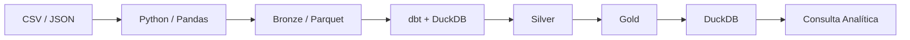

# Arquitetura da PoC



## As etapas da jornada

| Etapa | Papel | Neste projeto |
|---|---|---|
| **Fonte** | Onde o dado nasce | `data/fontes_poc/` — CSVs e JSON "exportados" dos sistemas do Tribunal |
| **Ingestão** | Trazer o dado para o pipeline | `src/ingest.py` (Pandas) |
| **Bronze** | Preservar o que chegou, rastreável | `data/bronze/*.parquet` |
| **Silver** | Limpar, tipar, padronizar, integrar | modelos `stg_*` (dbt) |
| **Gold** | Organizar para uma necessidade de consumo | `fato_processo` + dimensões (dbt) |
| **Serving** | Disponibilizar para consulta | DuckDB (`data/analytics.duckdb`) |
| **Consumo** | Transformar dado em informação útil | SQL / indicadores |

## Decisões de arquitetura

**Medallion como organização didática.** Bronze/Silver/Gold são uma convenção (nem toda arquitetura usa esses nomes). O princípio que importa é o **refinamento progressivo com rastreabilidade**: sempre dá para voltar uma camada e entender de onde o dado veio.

**O storage é a pasta `data/` — e o Medallion é visível nela.** Bronze, Silver e Gold são pastas com arquivos Parquet: a ingestão escreve o Bronze; o dbt escreve Silver e Gold (materialização `external` do dbt-duckdb — veja o `location` no config de cada modelo). O DuckDB não "guarda" os dados: ele registra views sobre esses arquivos e os consulta. Separação entre armazenamento (arquivos) e processamento (engine) — o mesmo princípio do Lakehouse, em miniatura. Em produção, `data/` viraria object storage (S3/MinIO); o raciocínio permanece.

**Ingestão fora do dbt.** O dbt transforma dados que já estão acessíveis a um engine analítico; trazer o dado até lá (ler JSON de uma API, CSV de um sistema) é papel do código de ingestão. Misturar os dois papéis esconde a fronteira entre Engenharia de ingestão e transformação declarativa.

**Bronze como string.** A ingestão lê tudo como texto e NÃO tipa. Tipar é interpretar — e interpretação é transformação (Silver). Se a tipagem falhar, queremos que falhe numa camada onde dá para tratar e testar, não na captura.

## A DAG que o dbt enxerga

```text
bronze.processos ──> stg_processos ──> fato_processo ─┐
bronze.comarcas ───> stg_comarcas ───> dim_comarca ───┤
bronze.classes ────> stg_classes ────> dim_classe ────┼──> consulta analítica
                                       dim_tempo ─────┘
(bronze.movimentacoes ─> stg_movimentacoes)  <- desafio
```

`source()` marca onde o dado ENTRA no domínio dbt; `ref()` declara dependência entre modelos. É isso que permite ao dbt construir na ordem certa, testar e desenhar o lineage (`dbt docs serve`).
