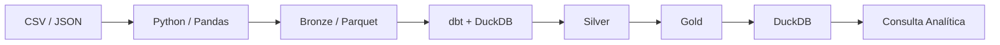
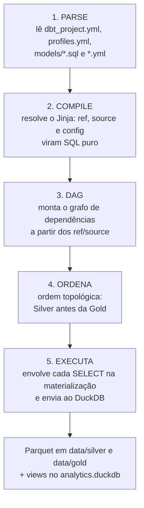

# Arquitetura da PoC



## As etapas da jornada

| Etapa | Papel | Neste projeto |
|---|---|---|
| **Fonte** | Onde o dado nasce | `data/raw/` — CSVs e JSON "exportados" dos sistemas do Tribunal (o que a origem entregou) |
| **Ingestão** | Trazer o dado para o pipeline | `src/ingest.py` (Pandas) |
| **Bronze** | Preservar o que chegou, rastreável | `data/bronze/*.parquet` |
| **Silver** | Limpar, tipar, padronizar, integrar | modelos `stg_*` (dbt) |
| **Gold** | Organizar para uma necessidade de consumo | `fato_processo` + dimensões (dbt) |
| **Serving** | Disponibilizar para consulta | DuckDB (`data/analytics.duckdb`) |
| **Consumo** | Transformar dado em informação útil | SQL / indicadores |

## Decisões de arquitetura

**Medallion como organização didática.** Bronze/Silver/Gold são uma convenção (nem toda arquitetura usa esses nomes). O princípio que importa é o **refinamento progressivo com rastreabilidade**: sempre dá para voltar uma camada e entender de onde o dado veio.

**O storage é a pasta `data/` — e o Medallion é visível nela.** Bronze, Silver e Gold são pastas com arquivos Parquet: a ingestão escreve o Bronze; o dbt escreve Silver e Gold (materialização `external` do dbt-duckdb — veja o `location` no config de cada modelo). O DuckDB não "guarda" os dados: ele registra views sobre esses arquivos e os consulta. Separação entre armazenamento (arquivos) e processamento (engine) — o mesmo princípio do Lakehouse, em miniatura. Em produção, `data/` viraria object storage (S3/MinIO); o raciocínio permanece.

**Ingestão fora do dbt.** O dbt transforma dados que já estão acessíveis a um engine analítico; trazer o dado até lá (ler JSON de uma API, CSV de um sistema) é papel do código de ingestão. Misturar os dois papéis esconde a fronteira entre Engenharia de ingestão e transformação declarativa.

**Bronze como string.** A ingestão lê tudo como texto e NÃO tipa. Tipar é interpretar — e interpretação é transformação (Silver). Se a tipagem falhar, queremos que falhe numa camada onde dá para tratar e testar, não na captura.


## Como o dbt executa (o que acontece quando você roda `dbt run`)

O dbt não processa dados. Ele **gera SQL e manda o motor executar**. Entre o seu `dbt run` e o resultado no disco existem cinco etapas:



### O que cada etapa faz

**1. Parse.** O dbt lê a configuração e todos os arquivos de `models/`. No log do projeto isso aparece como:

```text
Found 8 models, 17 data tests, 4 sources, 472 macros
```

O resultado desta etapa é o **`target/manifest.json`** — um inventário completo do projeto: cada modelo, suas colunas, seus testes e, principalmente, **de quem ele depende**.

**2. Compile.** As expressões `{{ }}` (Jinja) são substituídas. O `{{ ref('stg_comarcas') }}` que você escreveu vira o endereço real da tabela. O SQL resultante fica em **`target/compiled/`** — é lá que você olha quando quer entender o que o dbt realmente entendeu do seu código.

**3. DAG.** A partir dos `ref()` e `source()` coletados no parse, o dbt monta o grafo de dependências. É informação que já está no manifest:

```text
depends_on de dim_comarca: ['model.tribunal.stg_comarcas']
```

**4. Ordena.** Com o grafo em mãos, o dbt calcula a ordem de execução (ordem topológica). Por isso a Silver é construída antes da Gold **sem que ninguém escreva essa ordem em lugar nenhum**. Se houvesse mais de uma *thread* configurada, ele também paralelizaria os modelos independentes.

**5. Executa.** Cada SELECT é envolvido pela materialização escolhida (aqui, `external`: gravar Parquet) e enviado ao DuckDB. O comando efetivamente executado fica em **`target/run/`**, e o resultado de cada modelo em **`target/run_results.json`**.

### Os artefatos de `target/`

| Arquivo/pasta | O que é | Quando olhar |
|---|---|---|
| `manifest.json` | inventário do projeto: modelos, testes, dependências | entender o que o dbt "enxerga" |
| `compiled/` | o SQL com `ref()` e `source()` já resolvidos | depurar a lógica de um modelo |
| `run/` | o comando completo enviado ao motor | entender a materialização |
| `run_results.json` | status e duração de cada modelo/teste | investigar falhas e lentidão |
| `graph.gpickle` | o grafo de dependências serializado | (uso interno do dbt) |

Esses arquivos são **gerados**, nunca editados à mão — por isso `target/` está no `.gitignore`.

### O ciclo de trabalho completo

```text
dbt debug   ->  confere ambiente e conexão com o motor
dbt run     ->  parse, compile, DAG, ordena e executa os modelos
dbt test    ->  transforma cada regra do schema.yml em consulta e procura violações
dbt docs    ->  gera o site de documentação com o lineage a partir do manifest
```

Repare que `dbt test` percorre as mesmas cinco etapas — só que, em vez de criar tabelas, ele executa consultas que **procuram linhas problemáticas**. Se alguma retorna resultado, o teste falha.

## A DAG que o dbt enxerga

```text
bronze.processos ──> stg_processos ──> fato_processo ─┐
bronze.comarcas ───> stg_comarcas ───> dim_comarca ───┤
bronze.classes ────> stg_classes ────> dim_classe ────┼──> consulta analítica
                                       dim_tempo ─────┘
(bronze.movimentacoes ─> stg_movimentacoes)  <- desafio
```

`source()` marca onde o dado ENTRA no domínio dbt; `ref()` declara dependência entre modelos. É isso que permite ao dbt construir na ordem certa, testar e desenhar o lineage (`dbt docs serve`).
